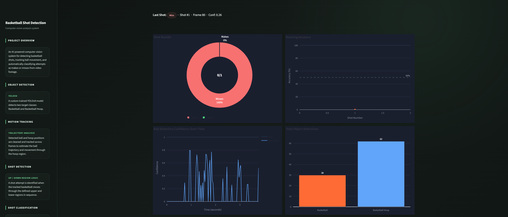
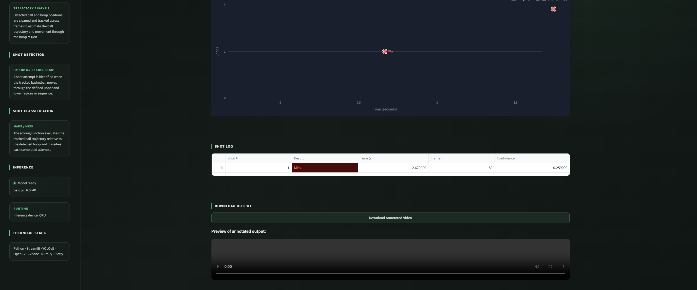

# AI Basketball Shot Detection & Tracker

A computer-vision system that detects a basketball and hoop in video, tracks ball trajectory across frames, and automatically classifies each shot attempt as a **make** or **miss** in real time.

## Core Technologies

| Component | Technology |
|---|---|
| Object Detection | **YOLOv8** (Ultralytics) — custom-trained on `Basketball` / `Basketball Hoop` classes |
| Video I/O & Rendering | **OpenCV** |
| Overlay Graphics | **cvzone** |
| Numerical Processing | **NumPy** (trajectory line-fitting via `polyfit`) |
| Deep Learning Backend | **PyTorch** (CUDA / MPS / CPU auto-selected) |
| Dashboard / Visualization | **Streamlit** |

## How It Works

**1.Detection** — Each frame is run through a fine-tuned YOLOv8 model; ball detections are accepted at conf > 0.3, relaxed to conf > 0.15 within in_hoop_region to preserve recall near the rim, while hoop detections require conf > 0.5.
**2.Position Cleaning** — clean_ball_pos/clean_hoop_pos reject outliers using a motion-consistency check (displacement > 4×√(w²+h²) within 5 frames) and an aspect-ratio check (w > 1.4h or h > 1.4w), discarding non-circular or teleporting detections.
**3.Shot Phase Detection** — detect_up flags entry into a region spanning ±4× hoop width and 2× hoop height above the rim; detect_down flags a y-crossing 0.5× hoop-height below center — a two-state FSM bounding each attempt.
**4.Scoring Logic** — score() fits a first-order polynomial (np.polyfit) to the ball's last pre-rim and post-rim points, extrapolates the x-position at rim height, and checks it against ±0.4× hoop-width bounds plus a 10px rebound-tolerance buffer to classify make/miss.
**5.Visualization** — Live overlay renders running score, make/miss text, and ball trail, with shot outcomes signaled via an alpha-blended color flash (cv2.addWeighted) that decays linearly over 20 frames.

## Project Structure

```
├── shot_detector.py     # Main inference loop: detection, tracking, scoring, display
├── train.py             # YOLOv8 training script (Basketball / Basketball Hoop)
├── utils.py             # Device selection, position cleaning, shot/scoring geometry
├── config.yaml          # Dataset config for training (train/valid/test paths)
├── best.pt              # Trained YOLOv8 weights
└── video_test_5.mp4     # Sample input video
```

## Real-World Test Video

In addition to the bundled sample clip, the system has been validated against a real-world recorded shooting session:

```
[Watch the real-world test video](./Streamlitdemo/TEST%20VIDEO.mp4)
```


## Dashboard

A Streamlit dashboard provides an interactive interface for running the detector and reviewing shot statistics.





## Training

`train.py` fine-tunes a YOLOv8n model on a Roboflow-exported dataset:

1. Download and extract a labeled dataset (`train/`, `valid/`, `test/`).
2. Point `config.yaml` to the dataset paths.
3. Run:
   ```bash
   python train.py
   ```
4. Copy the resulting `best.pt` into the project root.

Training hyperparameters (epochs, augmentation, learning rate, etc.) are centralized in the `TRAIN_CONFIG` dictionary for easy experimentation.

## Usage

```bash
python shot_detector.py
```

Press `q` to exit the live view.

## Notes

- Device selection (`get_device`) automatically falls back CUDA → MPS → CPU, making the pipeline portable across GPU and CPU-only environments.
- Confidence thresholds are relaxed near the hoop region (`in_hoop_region`) to improve recall on the ball during critical scoring moments.
